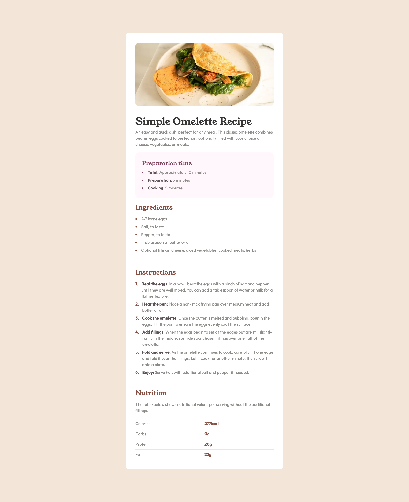

This repo is for practising writing frontend components with Next.js, Tailwind and Typescript

lists of components accessible on: https://frontend-practise-zeta.vercel.app/

There are static pages:

responsive pages

and a few apps